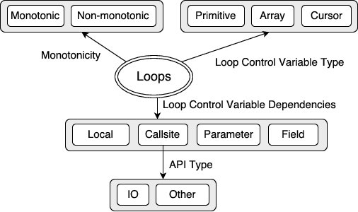

## Overview
The Loop Comprehension Toolbox provides a suite of tools to reason about loops. It was created to assist a human analyst in detection of Algorithmic Complexity Vulnerabilities (ACV). It is implemented using Atlas, a program analysis platform.

## Features
The Loop Comprehension Toolbox project supports the following.

- Characterization of loops in an app (Java source/Java Bytecode). We use following attributes to characterize loops.

- Following characterizations are supported (see tutorial for more details)
  - Loop Monotonicity
  - Loop Termination Patterns
  - Java API interactions of a loop and their classification
  - Statistics about loop's control flow and and data flow (number of paths, callsites etc.)
- Abstractions to reason about a loop's termination
 - Termination Dependence Graph (TDG) - Data flow abstraction
 - Loop Projected Control Graph (LPCG) - Control flow abstraction
- Loop Catalog Generation - A catalog of all loops containing summary of all the characteristics.

## Getting Started
Ready to get started?

1. First [install](/loop-comprehension-toolbox/install) the Loop Comprehension Toolbox plugin
2. Then check out the provided [tutorials](/loop-comprehension-toolbox/tutorials) to jump start your analysis

## Source Code
Need additional resources? Grab a copy of the [source](https://github.com/EnSoftCorp/loop-comprehension-toolbox).
